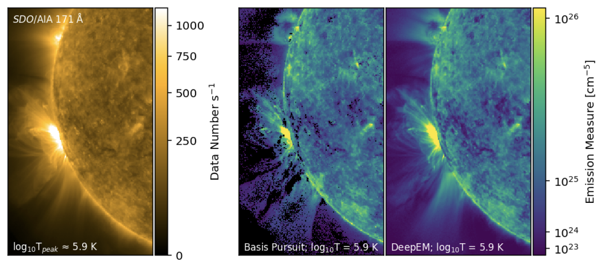

# Temperature Maps of the Solar Atmosphere
*DeepEM: A deep-learning approach to differential emission measure inversion using a 1x1 Convolutional Neural Network*

### Introduction

The Solar Dynamics Observatory’s Atmospheric Imaging Assembly (AIA; Lemen et al. 2012) captures high-resolution images of the full Sun in 10 wavelength bands, including seven Extreme Ultraviolet (EUV) channels centered on wavelengths between 94 and 335 Å. Each of these filter channels has a different and overlapping response to radiation emitted by plasma at different temperatures, and as such the thermal distribution of the observed plasma cannot be directly inferred from the EUV images. 

To learn about coronal temperatures, we must separate the multi-thermal nature of coronal plasma from the multi-thermal response of the EUV channels. There are a number of methods that can be used to recover the temperature distribution from these images, however each performs the inversion on a pixel-by-pixel basis, and are generally computationally expensive.

In this project, we propose using a convolutional neural network to accelerate an existing method for determining the temperature distribution of coronal plasma using observations from SDO/AIA.

### Results

We utilised a convolutional neural network (CNN) with a kernel size of 1x1, accelerating the computation by a factor of ~104 while returning solutions with similar fidelity to Basis Pursuit (**Figure 1**). Importantly, DeepEM provides solutions for *all pixels*, allowing the time-dependent temperature variability in the solar corona to be studied. 

**Figure 1**: *Left*, *SDO/*AIA image of the solar corona in the relatively iso-thermal 171 Å filter channel. This channel is sensitive to plasma at log T ≈ 5.9 K. *Right:* Temperature maps shown at log T = 5.9 K as recovered by Basis Pursuit (BP) and DeepEM (trained on 512 x 512 BP solutions). Locations where BP failed to converge are shown as black pixels. 
