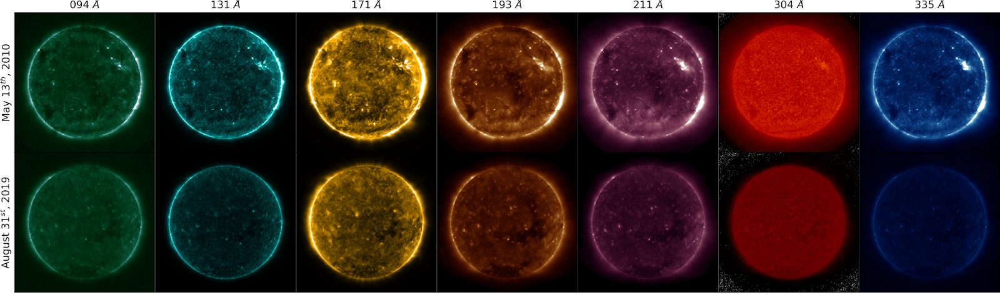
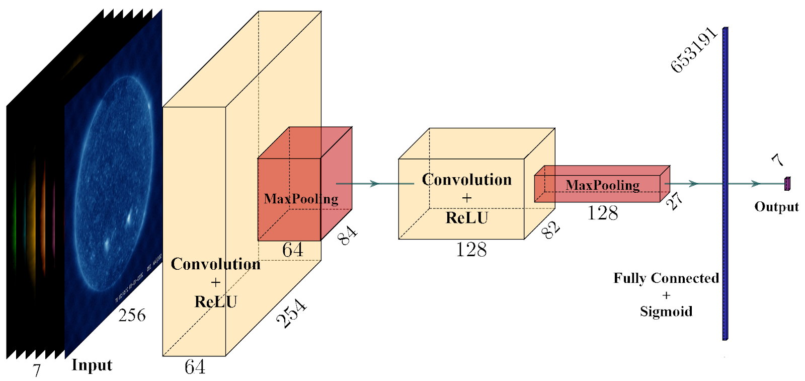

# SDO/AIA Autocalibration
Demonstration of the SDO/AIA autocalibration ([Dos Santos *et al* 2021 *A&A*](https://ui.adsabs.harvard.edu/abs/2021A%26A...648A..53D/abstract)); see the code here: https://github.com/vale-salvatelli/sdo-autocal_pub

[](https://colab.research.google.com/github/spaceml-org/helionb-sdoml/blob/main/notebooks/04_aia_autocalibration_2019/aia_autocalibration_colab.ipynb)

### Overview

Remote-sensing instruments on-board heliophysics space missions provide a pool of information about solar activity by measuring the solar magnetic field and the emission of light from the multilayered, multi-thermal, and dynamic solar atmosphere. Extreme ultraviolet (EUV) wavelength observations from space help in understanding the subtleties of the outer layers of the Sun, that is, the chromosphere and the corona. Unfortunately, EUV imagers onboard different spacecraft, such as NASA Solar Dynamics Observatory (SDO), Solar Orbiter, and STEREO, suffer from time-dependent degradation, reducing their sensitivity. 


**Figure 1**: Images as observed from SDO/AIA prior to degradation correction.

The current best calibration techniques for SDO’s Atmospheric Imaging Assembly (AIA) rely on flights of sounding rockets to maintain absolute calibration. These flights are infrequent, complex, and limited to a single vantage point. Therefore, we aim to develop a novel method based on machine learning (ML) that exploits spatial patterns on the solar surface across multiwavelength observations to auto calibrate the instrument degradation.


### Results

Our approach establishes the framework for a novel technique based on convolutional neural networks (CNNs) to calibrate EUV instruments. We established two CNN architectures that took either single-channel or multichannel input and trained the models using the SDOML dataset (Galvez et al., 2019). The dataset was further augmented by randomly degrading images at each epoch, with the training dataset spanning non overlapping months with the test dataset. 


**Figure 2**: Multichannel CNN approach to degradation prediction.


The results of the ML approach (see Figure 2), were compared to the the AIA multichannel degradation curves derived from sounding-rocket data. The results indicate that the CNN-based models significantly outperform the non-ML baseline model in calibrating instrument degradation. The CNN-based models reproduce the degradation corrections derived from the sounding-rocket cross-calibration measurements within the experimental measurement uncertainty, indicating that it performs equally well as current techniques.

In addition, [Dos Santos *et al* 2021 *A&A*](https://ui.adsabs.harvard.edu/abs/2021A%26A...648A..53D/abstract) reconstructed the degradation curves from 2010 to 2020 and compared the results with models used today to calibrate AIA EUV images. The approach establishes the framework for a novel technique based on CNNs to calibrate EUV instruments. We envision that our technique can be adapted to other imaging or spectral instruments operating at different wavelengths.


---

### Local development

```
git clone https://github.com/vale-salvatelli/sdo-autocal_pub
```

`conda env create -f environment.yml` will `pip install -e sdo-autocal_pub/.` in the background.

